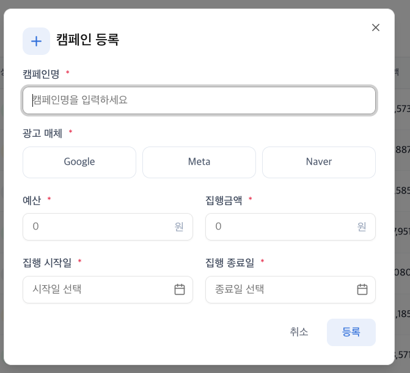

### 3.4 캠페인 등록 모달(CampaignRegisterModal.tsx)

- **인터랙션:** [캠페인 등록] 버튼 클릭 시 모달 노출
- **유효성 검사:** 검사 실패 시, 해당 필드 하단에 에러 메시지 표시
- **`평가 포인트`상태 동기화:** **등록 성공 시 별도의 새로고침 없이** 목록과 대시보드 차트에 즉시 반영되어야 함
  - 신규 캠페인은 `daily_stats`가 없으므로, 테이블에서 지표는 0 또는 -으로 표시되어도 무방합니다.
- **자동 설정 값:**
  - 상태: `active (진행 중)`로 고정
  - 캠페인 ID: 고유한 식별값 자동 생성
- **데이터 영속성:** 브라우저 세션 내 유지 (새로고침 시 초기화 허용)

| **입력 필드** | **타입** | **필수** | **유효성 검사 규칙**                    |
| ------------- | -------- | -------- | --------------------------------------- |
| **캠페인명**  | 텍스트   | O        | 2자 ~ 100자                             |
| **광고 매체** | 선택     | O        | Google, Meta, Naver 중 택 1             |
| **예산**      | 숫자     | O        | 정수, 100원 ~ 10억 원                   |
| **집행 금액** | 숫자     | O        | 정수, 0원 ~ 10억 원, **예산 초과 불가** |
| **시작일**    | 날짜     | O        |                                         |
| **종료일**    | 날짜     | O        | 시작일 이후                             |
