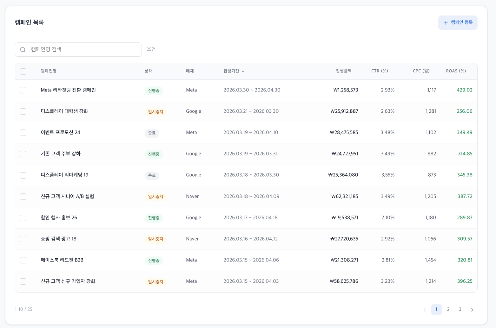

### 3.3 캠페인 관리 테이블(CampaignTable.tsx)

- **컬럼**: 캠페인명, 상태, 매체, 집행기간(시작일~종료일), 총 집행금액, CTR(%), CPC(원), ROAS (%)
- **정렬**: 집행기간, 총 집행금액, CTR, CPC, ROAS 컬럼에 대해 오름차순/내림차순 정렬
- **검색**: 캠페인명 실시간 검색 (**단, 테이블에만 적용**)
  - 검색 결과 건수 / 전체 건수 표시
- **페이지네이션**: 1페이지당 10건 노출
- **`평가 포인트`일괄 상태 변경**: 체크박스로 캠페인 선택 → 드롭다운으로 상태(진행중/일시중지/종료) 일괄 변경
