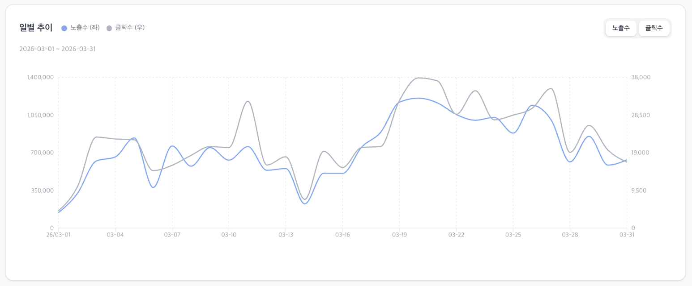

### 3.2 일별 추이 차트(DailyStatsGraph.tsx)

- 필터링된 캠페인의 일별 데이터를 시각화합니다.
- **차트 구성**: X축(날짜), Y축(수치), 범례(Legend) 필수
- **메트릭 토글**
  - **초기값**: '노출수', '클릭수' 모두 활성화 (중복 선택 가능)
  - **제약**: 최소 1개의 지표는 반드시 선택된 상태 유지
- **인터랙션**: 호버 시 해당 날짜의 수치를 툴팁으로 표시
