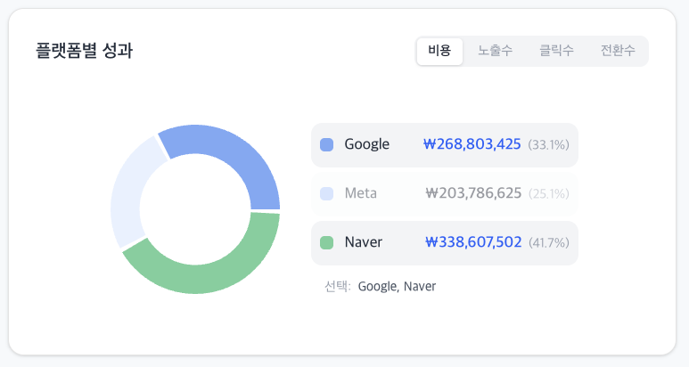

### 4.1 플랫폼별 성과 차트 (PlatformResultGraph.tsx)

- **메트릭 토글**: 비용 / 노출수 / 클릭수 / 전환수 (기본값: 비용)
- **차트**: 플랫폼별(Google / Meta / Naver) 비중 표시
- 메트릭 수치와 비중(%) 동시 표기
- **`평가 포인트`** 차트 클릭 시, 상단 글로벌 필터와 양방향 연동 (필터 적용/해제)
  - ex) 도넛의 Google 영역 클릭 → 상단 매체 필터에 'Google' 적용 → 모든 데이터 연동
